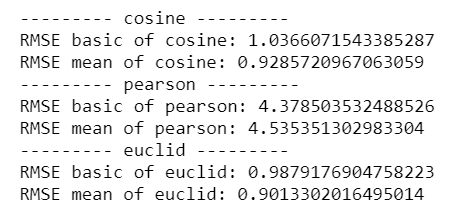
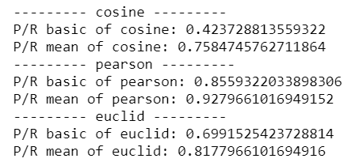
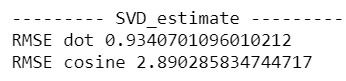
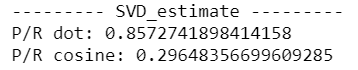

**Recommenders: Task 2**

**Bernat Esquirol**

## Problem statement

The base problem is figuring out which movies to recommend to a given set of users that have already ranked a several movies before. We will do this by training an algorithm that learns which rating would a user give for an unseen movie. We’ll use the dataset movielens-100k. This dataset consists of 100.000 ratings from 943 different users of 1682 movies.
The code for the implementation done in this task can be found at: 

​	https://github.com/bernatesquirol/recommenders_task2

## Used Methods

We’ll start with the notebooks done in class, a user based recommender notebook and a SVD notebook.

### Item based method

We tried different approaches for the item based method. The basis of this method is computing a similarity matrix for the items of the dataset. So we’ll have a 1682x1682 symmetric matrix and in each cell we’ll have the similarity between movies. This similarity will be computed by looking at the users ratings. We’ll pivot the ratings database to one such that has as rows the different movies, as columns the different users and as values the rating of that given user for that given movie.

|            | User 1       | ...  | User 943       |
| ---------- | ------------ | ---- | -------------- |
| Movie 1    | $r_{1,1}$    | ...  | $r_{1,943}$    |
| ...        | ...          | ...  | ...            |
| Movie 1682 | $r_{1682,1}$ | ...  | $r_{1682,943}$ |

The similarity will be a value between 0 and 1, and will be a function that takes as input two row vectors. So if most of the users rated similarly two movies, we’ll consider them close. We’ll compare several similarity measures. To see which performs better. Once we have the distance matrix we have to establish a method to give a rating. We tried two of these methods with these formulas

$$
\hat{r}_{u, j}=\frac{\sum_{i \in P_{k}(j)} \operatorname{sim}(i, j) \times r_{u, i}}{\sum_{i \in P_{k}(j)} \operatorname{sim}(i, j)}
$$

$$
\hat{r}_{u, j}=\bar{r}_{j}+\frac{\sum_{i \in P_{k}(j)} \operatorname{sim}(i, j) \times\left(r_{u, i}-\bar{r}_{i}\right)}{\sum_{v \in P_{k}(j)} \operatorname{sim}(i, j)}
$$

$\hat{r}_{u, j}$: predicted rating for user $u$ 

$r_{u,i}$: rating for user $u$ and movie $i$, $\bar{r}_{j}$ is the mean rating for the film.

$P_{k}(j)$: the k-nearest movies to $j$

This method takes long time to train (calculate distances between movies) and also is very slow to evaluate in the dataset given. Could be that the code I did is not the most optimal one, but still there are a lot of operations involved.

The code is done so that we can save the symmetry matrix for a given training data, so we don't have to retrain everything again.

To evaluate we have two methods also: the minimum squared error and the top-n precision recall measure [^Cremonesi et al, 2010]. For both of them I had to subsample the test set as it was too much computionally intensive for the whole trainset (20% of the database).

#### Implementation

I chose three distances (three different models) to evaluate their performance. Cosine similarity, euclid similarity and pearson similarity. I also calculated the symmetry matrices for the adjusted cosine and adjusted pearson. Those distances consist of substracting from all the ratings the mean rating for the user. So we avoid the user bias. But I made the error in the prediction function (probably I didn't transform the test dataset the same way as the train dataset), so the evaluations where very bad, and as it was a very costly process I decided to skip them. 

#### Results

We can see that although `euclid` does produce less squared error, in the P/R performs worse than `pearson`.

### Factorization method

With the factorization method we start with a exactly the same matrix as the table in Item based methods, and we compute with a dimensionality reduction algorithm its compressed version. This is a much more quick learning procedure than Item based algorithm, and also will result in a much faster predicting model and evaluation. At the prediction step, things are easier also, as we only need to compute a product between the similarity between user reduced vectors and the item reduced vectors. 

The drawback of this approach is that we lose some transparency in the algorithm as the dimensionality reduction algorithms are not as tangible as the procedure we did in the Item Based approach.

#### Implementation

As similarities in the prediction step we implemented the dot product and the cosine similarity. 

#### Results

We can see how the dot product performs way better than the cosine similarity.

## Conclusions

Overall the factorization methods give such speed that is difficult to stick to the item-based / user-based approaches. Although we can see more clearly how the prediction is made with the first approach, with a dataset such as that we have here, is not optimal at all.

Truth is the results we obtained are not very consistent, specially those in the item based recommendation. Also we couldn't have the adjusted cosine and adjusted pearson similarity that mayb improve the item based solution.

In the Factorization based method we could try different methods of dimentionality reduction.

[^Cremonesi et al, 2010]:https://www.researchgate.net/publication/221141030_Performance_of_recommender_algorithms_on_top-N_recommendation_tasks